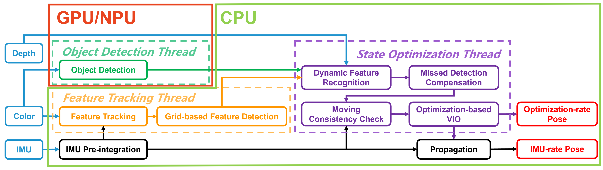
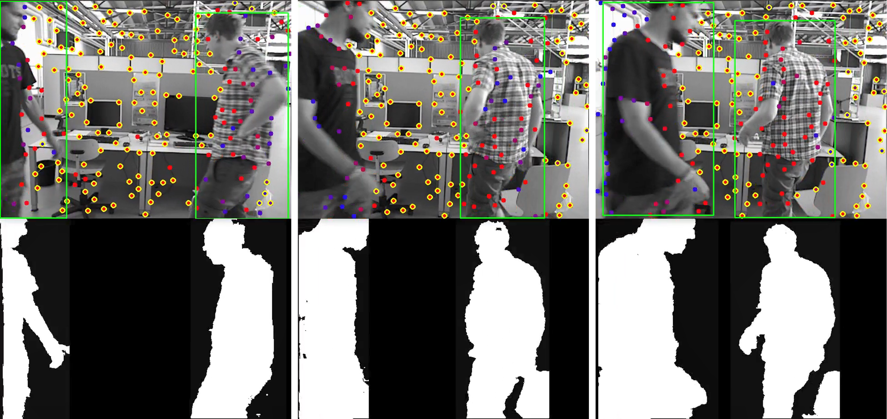

# Dynamic-VINS

# RGB-D Inertial Odometry for a Resource-restricted Robot in Dynamic Environments

## 1. Introduction
**Dynamic-VINS** is a real-time RGB-D Inertial Odometry system for resource-restricted robots in dynamic environments.
- Dynamic feature recognition by object detection and depth information with the performance comparable to semantic segmentation.
- Grid-based feature detection and efficient high-quality FAST feature extraction.
- Competitive localization accuracy and robustness in dynamic environments are shown in a real-time application on  resource-restricted platforms, such as [HUAWEI Atlas200 DK](https://e.huawei.com/en/products/cloud-computing-dc/atlas/atlas-200), [NVIDIA Jetson AGX Xavier](https://www.nvidia.com/en-us/autonomous-machines/embedded-systems/jetson-agx-xavier/).

Authors: [Jianheng Liu](https://github.com/jianhengLiu), Xuanfu Li, [Yueqian Liu](https://github.com/ErcBunny), and [Haoyao Chen](https://github.com/HitszChen) from the [Networked RObotics and Sytems Lab](http://www.nrs-lab.com), [HITSZ](https://www.hitsz.edu.cn/index.html)

If you use Dynamic-VINS for your academic research, please cite the following paper [[pdf](https://arxiv.org/pdf/2304.10987.pdf)]. 
```
@ARTICLE{9830851,  
  author={Liu, Jianheng and Li, Xuanfu and Liu, Yueqian and Chen, Haoyao},  
  journal={IEEE Robotics and Automation Letters},  
  title={RGB-D Inertial Odometry for a Resource-Restricted Robot in Dynamic Environments},   
  year={2022},  
  volume={7},  
  number={4},  
  pages={9573-9580},  
  doi={10.1109/LRA.2022.3191193}}
```
  

### 1.1. Framework

<div align="center"></div>

### 1.2. Related Video:

<div align="center">
    <a href="https://youtu.be/y0U1IVtFBwY" target="blank">
    
    </a>
</div>


**Video links:** [Youtube](https://youtu.be/y0U1IVtFBwY) or [Bilibili](https://www.bilibili.com/video/BV1bF411t7mx).


## 2. Installation
Tested on Ubuntu 18.04 and 20.04.

Find how to install Dynamic-VINS and its dependencies here: **[Installation instructions](./doc/INSTALL.md)**.

## 3. Run datasets examples

### 3.1. OpenLORIS
Download [OpenLORIS](https://shimo.im/docs/HhJj6XHYhdRQ6jjk/read) datasets.

Take [OpenLORIS-cafe](https://drive.google.com/file/d/1lVhp6Z8GxXFCPd8bR9plHFoVZUadYiBZ/view) as examples.

```
tar -xzvf cafe1-1_2-rosbag.tar
cd cafe
rosbag decompress cafe*
python YOUR_PATH_TO_DYNAMIC_VINS/scripts/merge_imu_topics.py cafe1-1.bag cafe1-2.bag
```

**NVIDIA devices (pytorch)**

```bash
roslaunch vins_estimator openloris_vio_pytorch.launch
roslaunch vins_estimator vins_rviz.launch # Visualization
rosbag play YOUR_PATH_TO_DATASET/cafe.bag 
```

**NVIDIA devices (tensorrt)**

```bash
roslaunch vins_estimator openloris_vio_tensorrt.launch
roslaunch vins_estimator vins_rviz.launch # Visualization
rosbag play YOUR_PATH_TO_DATASET/cafe.bag 
```

**HUAWEI Atlas200DK**

```bash
roslaunch vins_estimator openloris_vio_atlas.launch
```
Running Dynamic-VINS on HUAWEI Atlas200DK requires multile devices communication setting. For specific instructions, please refer to the [MULTIPLE_DEVICES](./doc/MULTIPLE_DEVICES.md). And other kinds of edge devices also could refer to this instruction.

### 3.2. HITSZ & THUSZ Datasets

Please prepare enough space for the [datasets](https://furtive-lamprey-00b.notion.site/Dynamic-VINS-Datasets-4458bad4d1104697b00410936919327d).
- HITSZ(41.0GB x 2)
- THUSZ(51.3GB x 2)

1. download datasets vis [Dyanmic-VINS-Datasets](https://furtive-lamprey-00b.notion.site/Dynamic-VINS-Datasets-4458bad4d1104697b00410936919327d).
2. run following cmd:
```bash
# bash scripts/download_hitsz.sh # bash scripts/download_thusz.sh
python3 scipts/rosbag_merge_chunk.py Datasets/hitsz_00.bag # python3 scipts/rosbag_merge_chunk.py Datasets/hitsz_00.bag
# rm ./Datasets/hitsz_*.bag # rm ./Datasets/thusz_*.bag
roslaunch vins_estimator realsense_vio_campus.launch
roslaunch vins_estimator vins_rviz.launch
rosbag play Datasets/hitsz.bag # rosbag play thusz.bag 
```

## 4. Configuration

- Detailed illustration of configuration please refer to [realsense configuration](./config/realsense/vio.yaml).
- A running procedure across two different platform is exampled in [Multiple Devices running_procedure](./doc/MULTIPLE_DEVICES.md).
- HUAWEI Atlas200DK setup please refer to [HUAWEI Atlas200DK Setup](https://support.huaweicloud.com/environment-deployment-Atlas200DK1012/atlased_04_0017.html).


## 5. Acknowledgments
 Dynamic-VINS is extended based on [VINS-Mono](https://github.com/HKUST-Aerial-Robotics/VINS-Mono), [VINS-RGBD](https://github.com/STAR-Center/VINS-RGBD), [yolov5](https://github.com/ultralytics/yolov5), [tensorrt_yolov5](https://github.com/wang-xinyu/tensorrtx/tree/master/yolov5), [ascend_yolo](https://gitee.com/ascend/samples/tree/master/cplusplus/level2_simple_inference/2_object_detection/YOLOV3_coco_detection_video).
